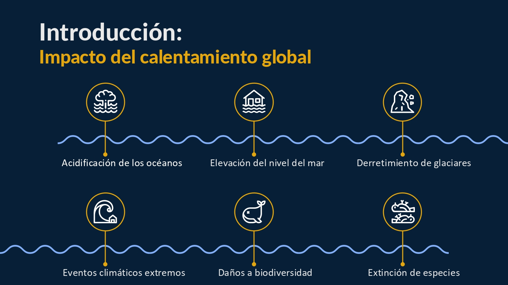
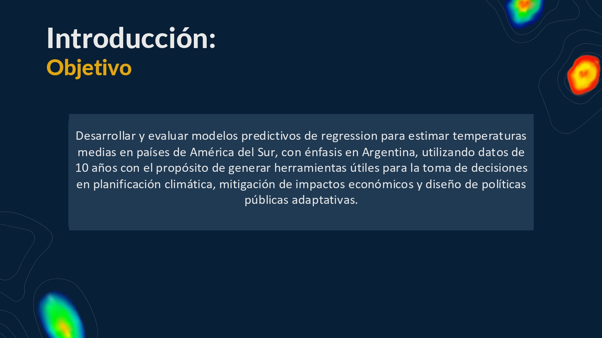
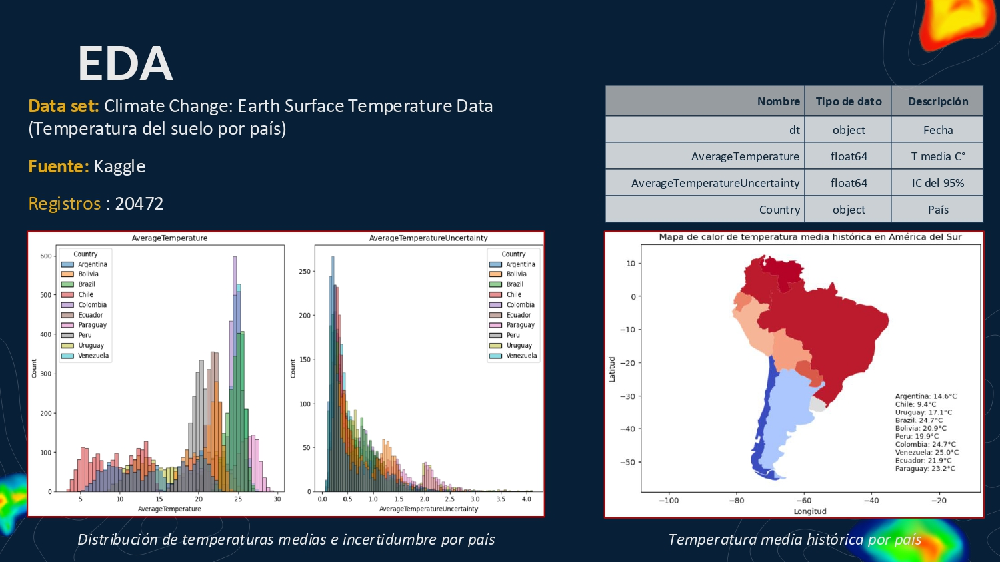
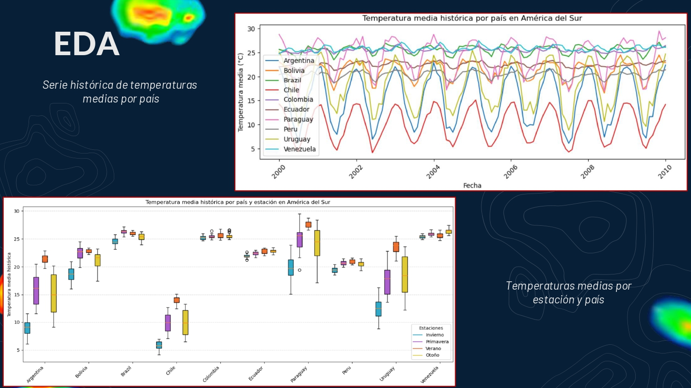
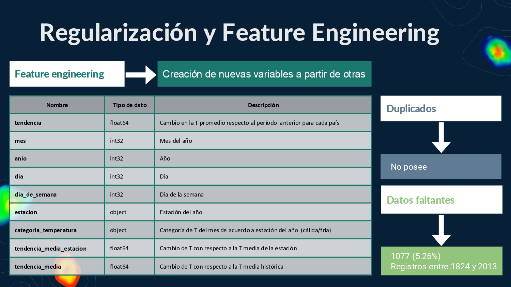
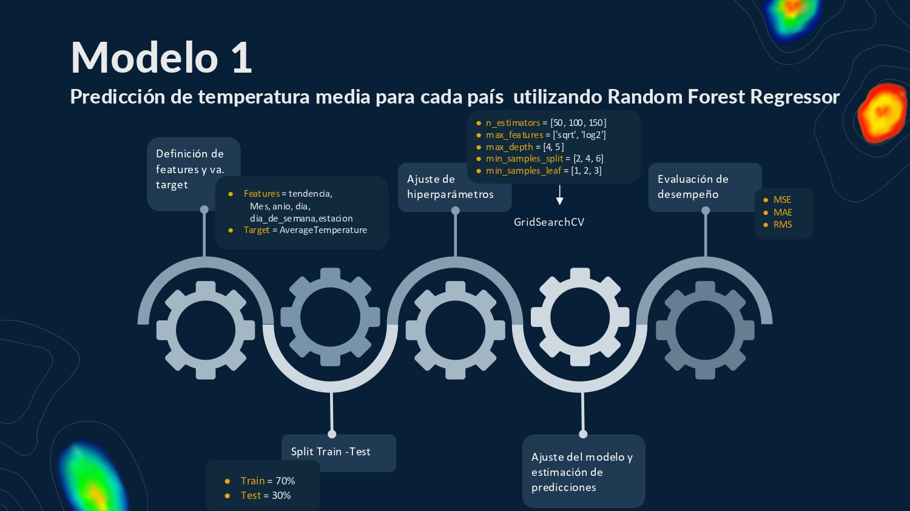
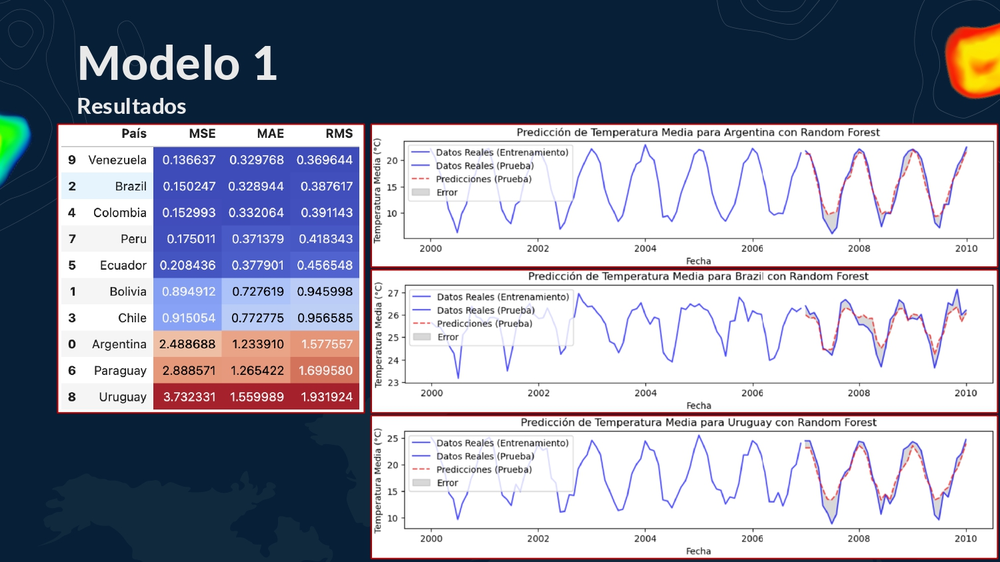
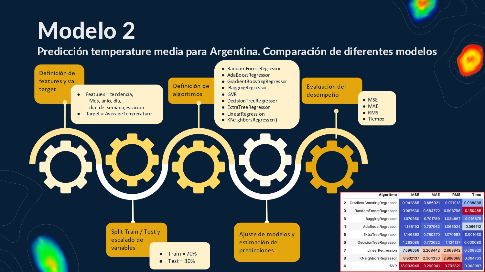
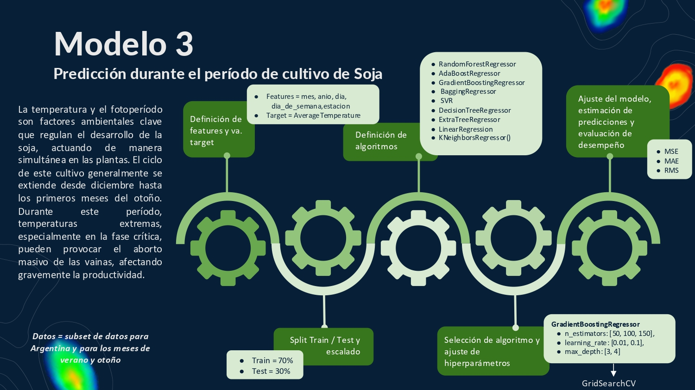
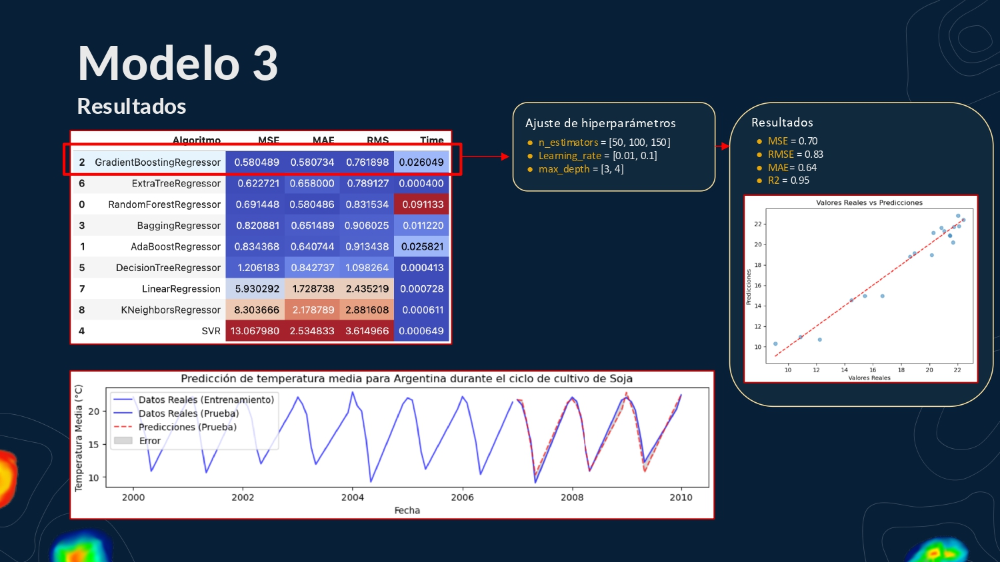

# 🌎 Predicción de Tendencias Climáticas en América del Sur usando Machine Learning

> 📚 **Proyecto Final - Módulo IV Diplomatura en Ciencia de Datos**  
---

## 📌 Descripción del Proyecto

El objetivo de este proyecto es **estimar las tendencias climáticas en los países de América del Sur, con foco especial en Argentina**, utilizando **métodos supervisados de Machine Learning**. Se busca proporcionar una herramienta predictiva que permita **evaluar las condiciones climáticas** y apoyar la **toma de decisiones estratégicas**, por ejemplo, en el sector agrícola.

A partir de datos históricos de temperatura, se entrenaron y evaluaron distintos modelos de regresión, seleccionando aquellos con mejor rendimiento para **predecir la temperatura media** en diferentes contextos temporales y espaciales.

---

## 🎯 Objetivos Específicos

- Analizar la **tendencia climática** de la región sudamericana, identificando patrones históricos de temperatura.
- Desarrollar modelos de **aprendizaje automático supervisado** para **predecir la temperatura media**.
- Evaluar el rendimiento de diferentes algoritmos de regresión y **seleccionar el modelo óptimo** para la predicción.
- Visualizar los resultados y generar métricas clave para la interpretación y la toma de decisiones.

---

## 🌐 Descripción de los Datos

- **Fuente de datos**: Kaggle Climate Change: Earth Surface Temperature Data (Temperatura del suelo por país)
- **Período analizado**: 2000 - 2010
- **Variables principales**:
  - Temperatura media histórica
  - Variaciones térmicas estacionales
  - Países de América del Sur (foco en Argentina)

---

## ⚙️ Herramientas y Tecnologías principales

- **Python**
- **Pandas**: manipulación y limpieza de datos  
- **Seaborn y Matplotlib**: visualización de datos y gráficos  
- **Scikit-learn**: desarrollo y evaluación de modelos de Machine Learning supervisado  
- **Jupyter Notebook**

---

## 🔬 Proceso de Análisis y Modelado

1. **Preprocesamiento de Datos**
   - Limpieza, manejo de valores nulos y outliers.
   - Exploración y análisis estadístico de la temperatura media.

2. **Análisis Exploratorio de Datos (EDA)**
   - Visualización de tendencias por país y estacionalidad.
   - Comparación de variaciones térmicas históricas.

3. **Modelado Predictivo**
   - Se utilizaron modelos supervisados de regresión para la predicción de temperatura media:
     - `RandomForestRegressor`
     - `GradientBoostingRegressor`
     - `AdaBoostRegressor`
     - `SVR (Support Vector Regression)`
   - Comparación de rendimiento entre modelos a través de métricas como:
     - **MSE** (Mean Squared Error)
     - **RMSE** (Root Mean Squared Error)
     - **MAE** (Mean Absolute Error)
     - **R² Score**

4. **Ajuste de Hiperparámetros**
   - Se aplicaron técnicas de optimización para mejorar el rendimiento del mejor modelo identificado (`GradientBoostingRegressor`).

---

## 📊 Principales Resultados

- **Variaciones Térmicas Detectadas**:  
  - Venezuela mostró temperaturas medias más cálidas, mientras que Chile tuvo temperaturas más frías, debido a sus características geográficas.
  - En Argentina, las temperaturas medias históricas fluctuaron entre 6°C y 24°C entre los años 2000 y 2010.

- **Mejor Modelo Predictivo**:  
  - **GradientBoostingRegressor**  
    - **MSE**: 0.70  
    - **RMSE**: 0.83  
    - **MAE**: 0.64  
    - **R² Score**: 0.95  
  - Este modelo se destacó por su **alta precisión** y **bajo tiempo de entrenamiento**, siendo una herramienta robusta para la predicción de temperaturas medias en Argentina.

---

## ✅ Conclusiones Generales

Este proyecto permitió:
- Aplicar técnicas de **Machine Learning supervisado** para resolver un problema de predicción climática.
- Utilizar bibliotecas de **análisis y visualización** para estructurar y explorar datos complejos.
- Comparar el desempeño de **diferentes algoritmos de regresión** y seleccionar el modelo más adecuado según el caso de uso.
- Obtener **información valiosa** que puede ser utilizada para la **toma de decisiones estratégicas**, como en la planificación agrícola o la gestión de recursos naturales en base a proyecciones climáticas.

---
  
__________________________________
  
__________________________________
  
__________________________________
  
_________________________________
  
________________________________
  
_________________________________
  
__________________________________
  
__________________________________
  
__________________________________
  
_________________________________
  
________________________________
  
____________________________
  
____________________________
  
____________________________
---
